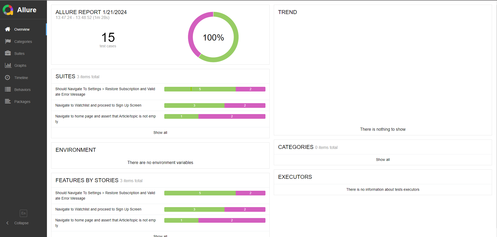

# Project is using WebdriverIO framework with mocha in javascript and Appium 
 
# $ First Step is to configure environment (Java, Android Studio, Virtual devices etc..)

## To start appium server on default port: 4723 - run:
```
appium
```
## To run tests, run next coomand in root directory:
```
npx wdio
```


# Project is configured to automatically generate allure report for CI purposes, to serve it run:

```
npx allure open
```

# Or the full command to Generate Allure report and serve it 
```
npx allure generate allure-results && npx allure open
# OR run them separately
# --clean for overridign old reports
npx allure generate allure-results --clean
```



### P.S In this project i decided not to use typical POM design pattern as mocha assertions looked weird and the encapsulating functionality behind the pattern was not that much from this viewpoint
